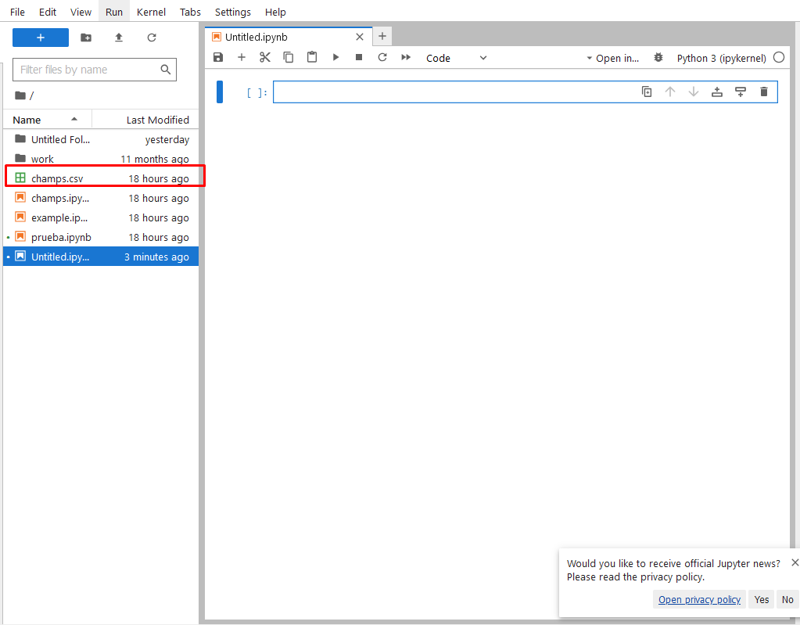

# Practica de Apache Spark
## Tabla de Contenidos
- [Practica de Apache Spark](#practica-de-apache-spark)
  - [Tabla de Contenidos](#tabla-de-contenidos)
  - [Introducción](#introducción)
  - [Instalación y configuracion](#instalación-y-configuracion)
    - [Prerrequisito](#prerrequisito)
    - [Generacion del contenedor:](#generacion-del-contenedor)
    - [Ejecutar docker-compose](#ejecutar-docker-compose)
    - [Acceder a Jupyter Notebook](#acceder-a-jupyter-notebook)
  - [Practica](#practica)
  - [Solucion](#solucion)

## Introducción
Debe realizar paso a paso lo que se le indica, hay dos formas de realizar la practica, puede utilizar la configuracion anteriormente mencionada en el video del ejemplo o puede utilizar la configuracion del uso de la imagen de docker.

## Instalación y configuracion
En esta practica se realizara la configuracion de la imagen **jupyter/pyspark-notebook*** para poder utilizarla en la practica.

### Prerrequisito
Debe tener configurado docker en su equipo dependiendo el tipo de sistema operativo que utilice.

[Descarga de docker](https://www.docker.com/products/docker-desktop/)

### Generacion del contenedor:
descargue o clone el repositorio, ubiquese dentro de la carpeta y ubique el archivo **docker-compose.yml** y este deberia contener lo siguiente:

```yaml
version: '3.8'

services:
  jupyter:
    image: jupyter/pyspark-notebook:latest
    container_name: jupyter
    ports:
      - "8888:8888"  # Puerto para la interfaz de Jupyter Notebook, para acceder a jupyter notebook, escriba en el navegador el siguiente url: http://localhost:8888
    environment:
      - SPARK_MASTER_URL=local[*]  # Ejecutar Spark en modo local
      - JUPYTER_ENABLE_LAB=yes
    command: start-notebook.sh --NotebookApp.token='' --NotebookApp.password=''
    networks:
      - jupyter-network

networks:
  jupyter-network:
    driver: bridge
```

### Ejecutar docker-compose
Debe ejecutar alguna de las siguientes lineas de comando.

```bash
docker-compose up
```
O

```bash
docker compose -f "docker-compose.yml" up -d --build
```

### Acceder a Jupyter Notebook
para acceder a jupyter notebook, escriba en el navegador el siguiente url:

`http://localhost:8888`


## Practica

**Si realizara la practica con la primera opcion, omita los pasos de configuracion de jupyter y solo copie el archivo csv y realice la carga del mismo**

Para la practica, luego de acceder a jupyter notebook debe crear un nuevo notebook para realizar las pruebas.


En la siguiente practica debe utilizar como fuente de datos el archivo csv llamado **champs.csv** alojado en este repositorio.
Para importar el archivo csv debe hacer lo siguiente:

Haga clic en el siguiente boton:


Ubique el documento y haga clic en abrir:

Deberia aparecer de esta forma:


**Resuelva lo siguiente**:
- Mostrar las primeras filas del DataFrame.
- Muestre el esquema del DataFrame.
- Filtrar los partidos donde el resultado fue empate 0-0.
- Seleccionar columnas específicas, como el equipo 1, equipo 2 y el marcador final.
- Contar el número de partidos jugados.

## Solucion
Para la practica debe realizar lo siguiente, por cada fragmento de codigo debe realizar una ejecucion de la celda, en algunos casos la celda no deberia imprimir ninguna salida:


Importar las librerías necesarias
```python
# Importar las librerías necesarias
from pyspark.sql import SparkSession
```
Crear una sesión de Spark
```python
# Crear una sesión de Spark
spark = SparkSession.builder \
    .appName("ChampionsData") \
    .getOrCreate()
```
Cargar el archivo CSV (en la misma carpeta del notebook)
```python
# Cargar el archivo CSV (en la misma carpeta del notebook)
file_path = "champs.csv"  # Al estar en la misma carpeta, solo necesitas el nombre del archivo
df = spark.read.csv(file_path, header=True, inferSchema=True)
```


1. Mostrar las primeras filas del DataFrame.
```python
# Mostrar las primeras filas del DataFrame
df.show(5)
```


2. Muestre el esquema del DataFrame.
```python
# Esquema del DataFrame
df.printSchema()
```


3. Filtrar los partidos donde el resultado fue empate 0-0.
```python
# Filtrar los partidos donde el resultado fue empate 0-0 (FT = 0-0)
df.filter(df['FT'] == '0-0').show()
```


4. Seleccionar columnas específicas, como el equipo 1, equipo 2 y el marcador final.
```python
# Seleccionar columnas específicas, como el equipo 1, equipo 2 y el marcador final
df.select("Team 1", "Team 2", "FT").show()
```


5. Seleccionar columnas específicas, como el equipo 1, equipo 2 y el marcador final.
```python
# Contar el número de partidos jugados
total_partidos = df.count()
print(f"Total de partidos jugados: {total_partidos}")
```
